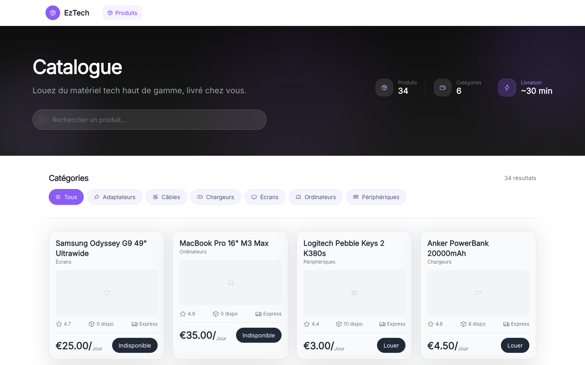
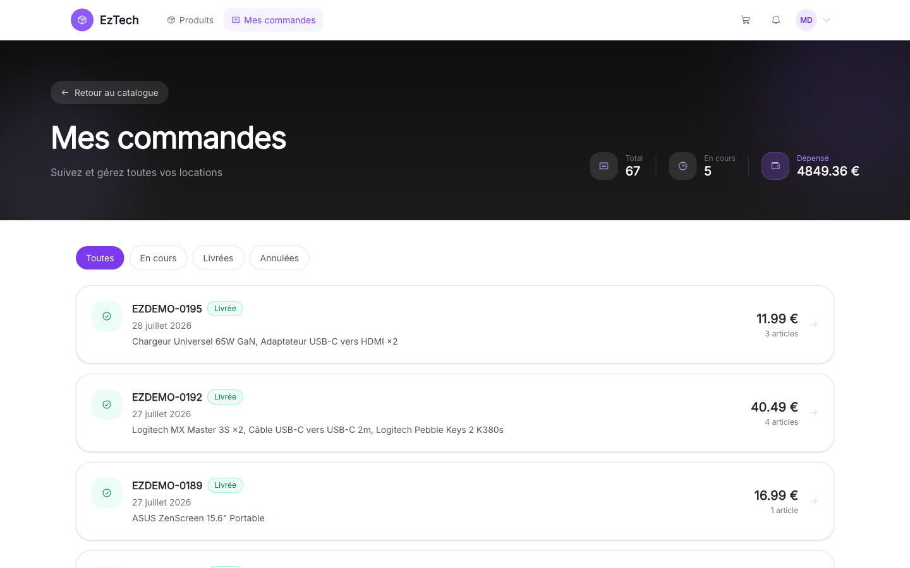
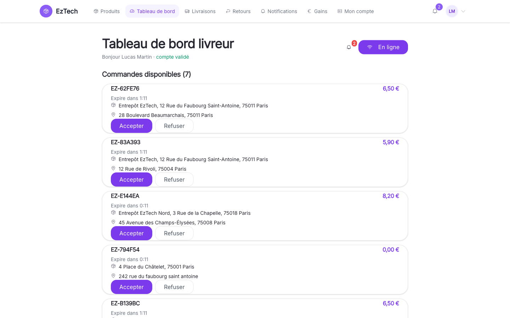
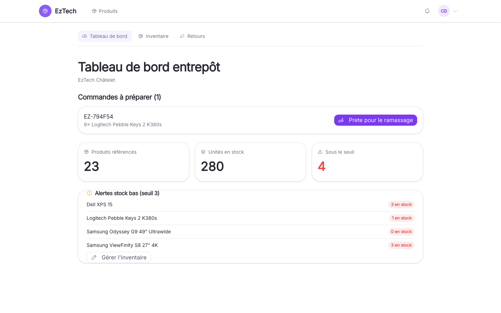
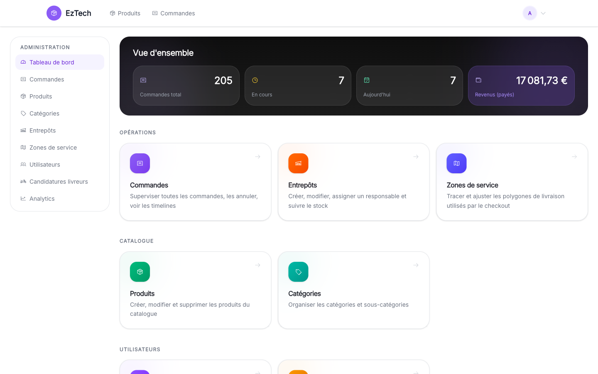
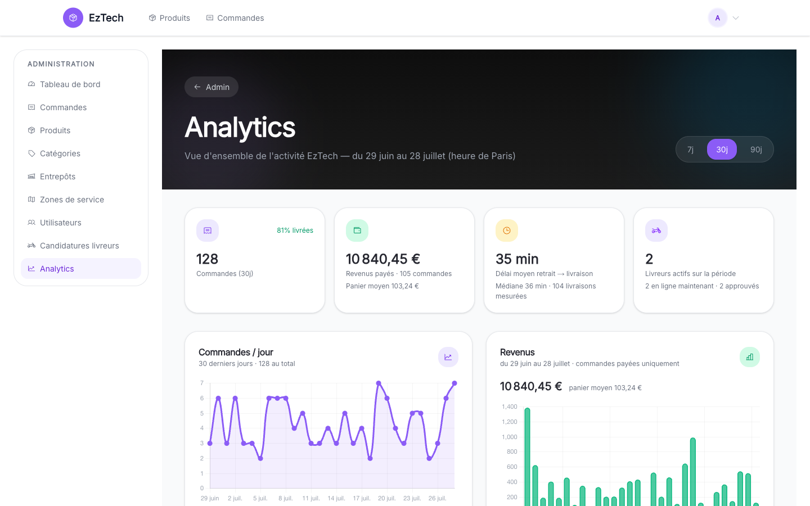
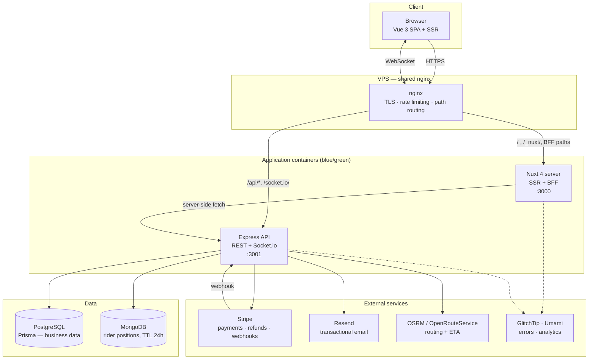
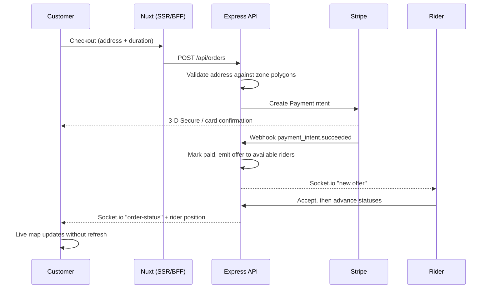

# EzTech

> Tech you need. Delivered in minutes.

On-demand tech equipment rental for Paris. Customers browse and rent gear (laptops, monitors,
cameras, peripherals), pay with Stripe, and a gig rider collects the item from a warehouse and
delivers it — with the delivery tracked live on a map. When the rental ends, the customer schedules
a return, a rider picks it up, and a warehouse manager inspects it back into stock.

**Live:** <https://eztech.thecodeman.cloud>

---

## Contents

- [What it does](#what-it-does)
- [Screenshots](#screenshots)
- [Architecture](#architecture)
- [Getting started](#getting-started)
- [Environment variables](#environment-variables)
- [Test credentials](#test-credentials)
- [Tests and quality gates](#tests-and-quality-gates)
- [Deployment](#deployment)
- [Limits and possible improvements](#limits-and-possible-improvements)
- [Image credits](docs/IMAGE-CREDITS.md)

---

## What it does

The product is built around **four roles**, each with its own authenticated area.

| Role | Can do |
| --- | --- |
| **Customer** | Browse and search the catalogue, rent by duration, pay by card, track the delivery live, cancel, schedule a return, manage addresses and profile |
| **Rider** | Apply with documents, go online, receive and accept offers, advance a delivery through its statuses, stream GPS position, collect returns, see earnings |
| **Warehouse manager** | Prepare outgoing orders, adjust stock per warehouse, inspect returned items back into stock or mark them damaged |
| **Admin** | Oversee every order, refund, manage the catalogue and categories, approve rider applications, manage users, warehouses and delivery zones, read analytics |

### Feature modules

| # | Module | Highlights |
| --- | --- | --- |
| 1 | **Auth & users** | JWT in httpOnly cookies + CSRF, refresh rotation, email verification, password reset, Google sign-in, self-service profile and addresses |
| 2 | **Catalogue & search** | Products, categories, brands, filters, sorting, pagination, flat vs tiered (hour/day/week) pricing |
| 3 | **Orders & rental** | Cart, checkout, order lifecycle with an event timeline, cancellation with refund and stock restore, late fees on overdue rentals |
| 4 | **Rider system** | Application and document upload, approval workflow, offer/decline with expiry, status transitions, earnings |
| 5 | **Real-time tracking** | Socket.io rooms, rider GPS streamed to Mongo, live map (Leaflet), routed ETA, arrival geofencing |
| 6 | **Warehouse** | Warehouses, per-warehouse stock, adjustments with an audit trail, order preparation, return inspection |
| 7 | **Admin panel** | Dashboard, orders oversight, refunds, product/category CRUD, users, rider approvals, warehouses, zone editor |
| 8 | **Notifications** | In-app bell + dedicated page, Socket.io push, email via Resend, per-user opt-out |
| 9 | **Payments** | Stripe Payment Intents, webhooks with signature verification, saved cards for off-session charges, idempotent admin refunds |
| 10 | **Infrastructure** | Docker Compose, CI on every PR, blue-green deploy, TLS, error tracking and analytics |

### Delivery zones

Checkout validates the delivery address against GeoJSON service-zone polygons (Turf.js), both in the
UI and — authoritatively — on the server. Admins draw and edit zones on a map.

---

## Screenshots

| Landing | Catalogue |
| --- | --- |
|  |  |

| Customer — orders | Rider — dashboard |
| --- | --- |
|  |  |

| Warehouse — dashboard | Admin — dashboard |
| --- | --- |
|  |  |

**Admin — analytics**



> Captured from the live production deployment, covering all four roles.

---

## Architecture



### Why a BFF sits in front of the API

The Nuxt server exposes a small **backend-for-frontend** layer (`frontend/server/api/*`) that reshapes
some backend responses for the storefront and keeps secrets (routing API keys) server-side. nginx
routes a fixed allowlist of paths to it — `/api/products`, `/api/orders`, `/api/zones`, `/api/config`,
`/api/geocode` — and everything else to Express.

> **Important for contributors:** because that split exists, admin and rider screens deliberately call
> `/api/admin/*` aliases for catalogue and order operations. Those aliases are mounted on the same
> Express routers with the same guards; they exist only so the request is not intercepted by the BFF,
> which has no write handlers and would silently turn a write into a read. Do not "simplify" them back
> to `/api/products` or `/api/orders`.

### Request lifecycle — placing an order



### Repository layout

```
eztech/
├── frontend/                  # Nuxt 4 (Vue 3, Composition API)
│   ├── app/
│   │   ├── components/        # UI + shadcn-vue primitives
│   │   ├── composables/       # tracking, sockets, notifications, admin API
│   │   ├── layouts/           # default · auth · admin · warehouse
│   │   ├── middleware/        # auth + role route guards
│   │   ├── pages/             # file-based routing (customer, rider, warehouse, admin)
│   │   └── stores/            # Pinia: auth, cart, orders, rider, warehouse
│   ├── server/api/            # BFF routes (see note above)
│   ├── e2e/                   # Playwright journeys
│   └── tests/                 # Vitest unit tests
│
├── backend/                   # Express + TypeScript
│   ├── prisma/                # schema, migrations, seeds
│   ├── src/
│   │   ├── routes/            # 17 routers (auth, orders, payments, rider, …)
│   │   ├── middleware/        # auth, roles, rate limiting, errors
│   │   ├── lib/               # stripe, socket, notifications, mongo, zones
│   │   └── jobs/              # node-cron (return reminders, late fees)
│   └── tests/                 # Vitest integration tests (real DB)
│
├── scripts/deploy.sh          # blue-green deployment
└── docker-compose.yml         # dev stack
```

---

## Getting started

### Prerequisites

- **Docker Desktop** — the only requirement for the recommended path
- Node.js **22.12+** and npm — only if you run natively (see `frontend/.nvmrc`)

### Run everything with Docker (recommended)

From `eztech/`, create the env files, set a JWT secret, then start:

```bash
cp .env.example .env                      # infra: Postgres, JWT, ports
cp backend/.env.example backend/.env      # Stripe keys, admin seed account
cp frontend/.env.example frontend/.env    # API URL, Stripe publishable key
```

`JWT_SECRET` ships **empty on purpose** and Compose refuses to start without it (min 32 chars):

```bash
node -e "console.log(require('crypto').randomBytes(48).toString('base64url'))"
# paste the result into JWT_SECRET= in eztech/.env
```

Then:

```bash
docker compose up --build
```

| Service | URL |
| --- | --- |
| Frontend | <http://localhost:3000> |
| API | <http://localhost:3001/api> |
| Adminer (DB UI) | <http://localhost:8080> |

The stack runs migrations and seeds the catalogue and demo accounts automatically on first boot.

### Run natively

```bash
# backend
cd backend
npm install
npx prisma migrate dev
npm run prisma:seed        # admin account
npm run seed:catalog       # products
npm run seed:demo          # customers, riders, warehouse manager, demo orders
npm run dev                # http://localhost:3001

# frontend (second terminal)
cd frontend
npm install
npm run dev                # http://localhost:3000
```

---

## Environment variables

### Root (`.env`) — infrastructure

| Variable | Description |
| --- | --- |
| `POSTGRES_USER` / `POSTGRES_PASSWORD` / `POSTGRES_DB` | Database credentials |
| `JWT_SECRET` | **Required**, min 32 chars. Generate it; there is no default |
| `JWT_ACCESS_TTL` / `JWT_REFRESH_TTL` | Token lifetimes (`15m` / `30d`) |
| `CORS_ORIGIN` | Allowed browser origin |
| `ADMIN_EMAIL` / `ADMIN_PASSWORD` | Seeded admin account |
| `SEED_CATALOG` / `SEED_DEMO` | Seed on boot |

### Backend (`backend/.env`)

| Variable | Description |
| --- | --- |
| `STRIPE_SECRET_KEY` / `STRIPE_PUBLISHABLE_KEY` | Stripe API keys |
| `STRIPE_WEBHOOK_SECRET` | `whsec_…`, must match the webhook destination |
| `RESEND_API_KEY` | Transactional email (optional in dev) |
| `GOOGLE_CLIENT_ID` | Google sign-in (optional) |
| `ORS_API_KEY` | OpenRouteService; falls back to keyless OSRM when unset |
| `DELIVERY_FEE` | Flat delivery fee |

### Frontend (`frontend/.env`)

| Variable | Default | Description |
| --- | --- | --- |
| `VITE_USE_MOCK` | `false` | Serve local JSON fixtures instead of the API |
| `VITE_API_URL` | `http://localhost:3001/api` | Backend API base URL |
| `VITE_STRIPE_PUBLISHABLE_KEY` | — | Stripe publishable key (public by design) |

---

## Test credentials

Seeded by `npm run seed:demo`, run automatically by the Docker dev stack.

| Role | Email | Password |
| --- | --- | --- |
| Customer | `marie@example.com` | `password123` |
| Customer | `thomas@example.com` | `password123` |
| Rider (approved) | `rider@eztech.fr` | `riderpass123` |
| Rider (application pending) | `rider3@eztech.fr` | `riderpass123` |
| Warehouse manager | `warehouse@eztech.fr` | `warehousepass123` |
| Admin | `admin@eztech.fr` | `$ADMIN_PASSWORD` |

> The admin password is whatever you set in `ADMIN_PASSWORD`; it has no hardcoded default outside the
> dev stack. Use `rider3@eztech.fr` to demonstrate the "application pending" gate.

---

## Tests and quality gates

```bash
cd backend  && npm run lint && npm run typecheck && npm test
cd frontend && npm run lint && npm run typecheck && npm test
cd frontend && npm run e2e        # Playwright, needs the stack running
```

Every pull request runs the same gates in CI:

| Job | Checks |
| --- | --- |
| `backend` | ESLint, `tsc --noEmit`, build, **295 Vitest tests** against real Postgres + Mongo containers |
| `frontend` | ESLint, `nuxi typecheck`, Vitest, production build |
| `e2e-smoke` | Playwright journeys (customer, rider, warehouse, cross-role real-time) on the full Docker stack |
| `docker-build` | Both images build |
| `migration-safety` | Rejects destructive Prisma migrations |

Backend tests run against real databases rather than mocks, so route guards, transactions and
Prisma behaviour are exercised for real.

---

## Deployment

Merging to `main` runs CI; a green CI triggers a **blue-green deploy** to the VPS.

`scripts/deploy.sh` builds images on the server, starts the inactive colour, health-checks it,
rewrites the nginx upstream to point at the new slot, validates the config, reloads nginx, then
drains and stops the old slot. A failed health check leaves traffic on the previous slot, so a bad
build cannot take the site down.

Observability: **GlitchTip** for errors, **Umami** for privacy-friendly analytics.

---

## Limits and possible improvements

Deliberate scoping decisions, stated plainly rather than hidden.

### Known limits

- **Product photos are illustrative, not the real models.** The 34 catalogue images come from
  Wikimedia Commons under free licences (see [Image credits](docs/IMAGE-CREDITS.md)). They match the
  product's category and usually its brand, but they are not photographs of the exact model sold.
  A real shop would need licensed product photography.
- **Content Security Policy is not nonce-based.** Production nginx still allows `'unsafe-inline'` and
  `'unsafe-eval'` for Nuxt hydration. Moving to nonces via `nuxt-security` was deferred.
- **The Stripe refund path is not covered end-to-end.** The endpoint is idempotent and unit-tested,
  but no automated test exercises the real Stripe call; `lib/stripe.ts` has no test-mode branch.
- **No frontend component tests.** `frontend/tests/` holds unit tests only — neither `@vue/test-utils`
  nor `@nuxt/test-utils` is installed, so Nuxt pages using `definePageMeta` cannot be mounted. Page
  behaviour is covered by Playwright instead.
- **Analytics are computed on read.** No pre-aggregation and no index on `Order.createdAt`, so a
  wide date range does a sequential scan. Fine at demo scale, not at production scale.
- **"Active riders" cannot be period-scoped.** `User.riderOnline` is a boolean with no history table
  and Mongo positions expire after 24h, so the endpoint reports `onlineNow` (point-in-time) and
  `activeInPeriod` (riders with events in the window) as two distinct numbers rather than inventing one.
- **Revenue is anchored on order creation**, not payment confirmation — there is no `paidAt` column,
  so an order paid the day after checkout is bucketed on its checkout day. The response declares this.
- **`Product.stock` and `WarehouseStock` are separate.** The storefront reads the former and
  fulfilment the latter; nothing reconciles them.
- **E2E timings are tuned to a cold dev server, not guaranteed.** `cross-rider-customer.spec.ts` runs
  first in the suite and pays the full Nuxt route-compilation cost (~26s observed in CI against ~5s
  for later specs). The hydration wait was raised from the 15s default to 30s to cover it, which
  removed the observed flakiness — but it is a timeout margin, not a hard guarantee under heavier load.

### Possible improvements

- Real product photography and an image upload pipeline
- Nonce-based CSP; move the remaining inline styles out
- Pre-aggregated analytics tables refreshed by the existing cron, plus the missing indexes
- A `RiderSession` table to make rider activity properly period-scoped
- `paidAt` on `Order` so revenue is anchored on payment
- A single source of truth for stock
- Component-test harness, and an `admin-journey` Playwright spec to complete the role matrix
- Multi-city support: zones, warehouses and pricing are already per-record, so the model allows it
