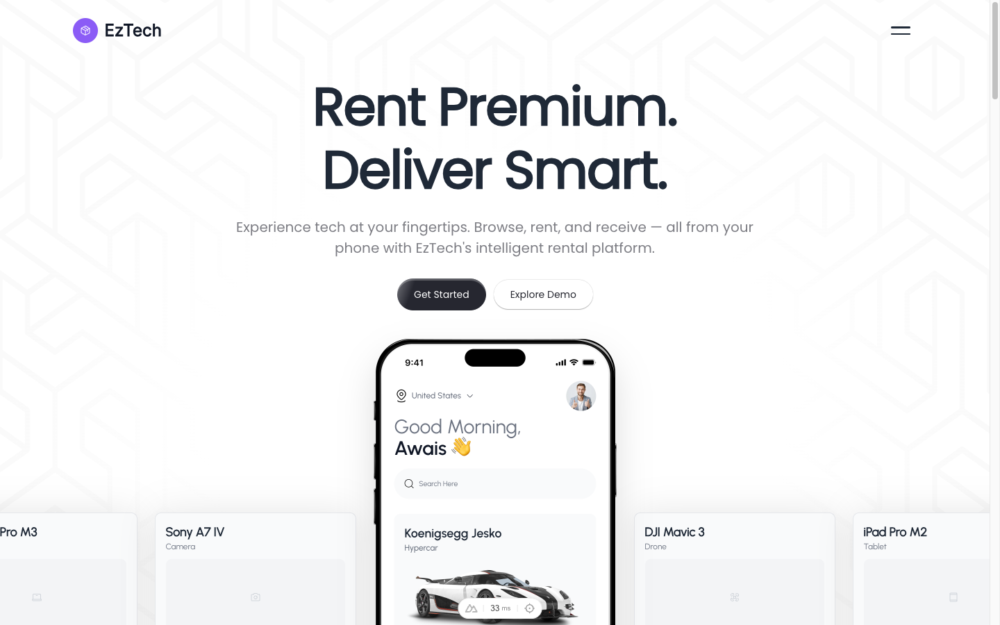
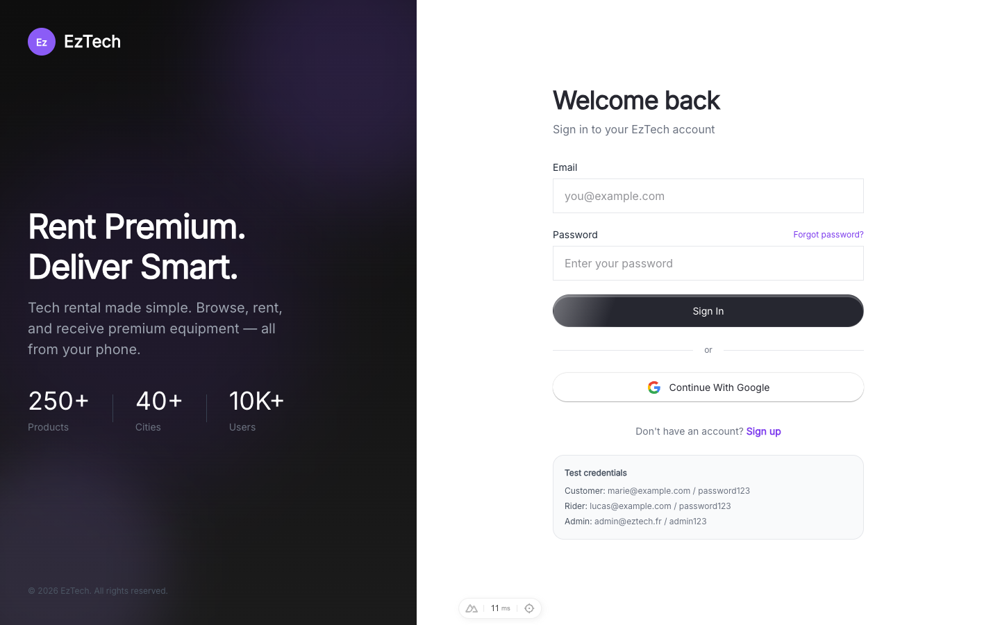
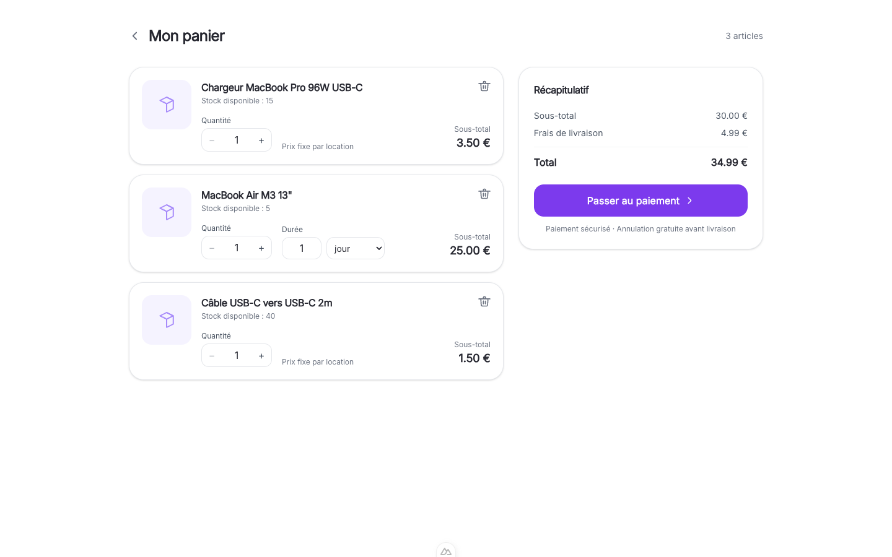
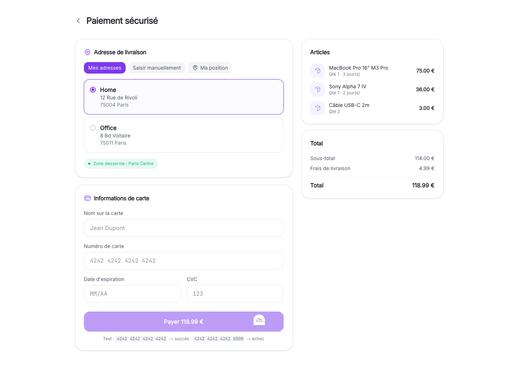
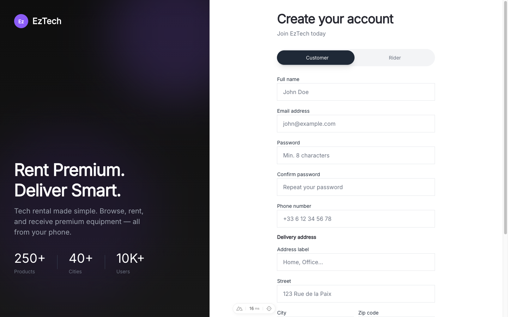
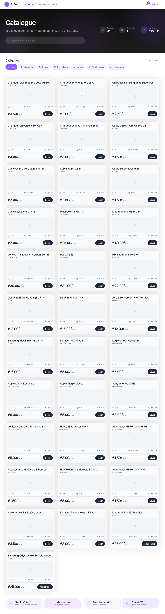
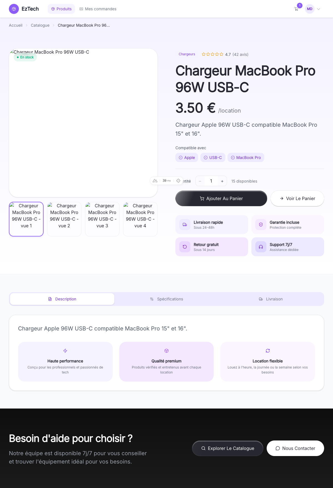
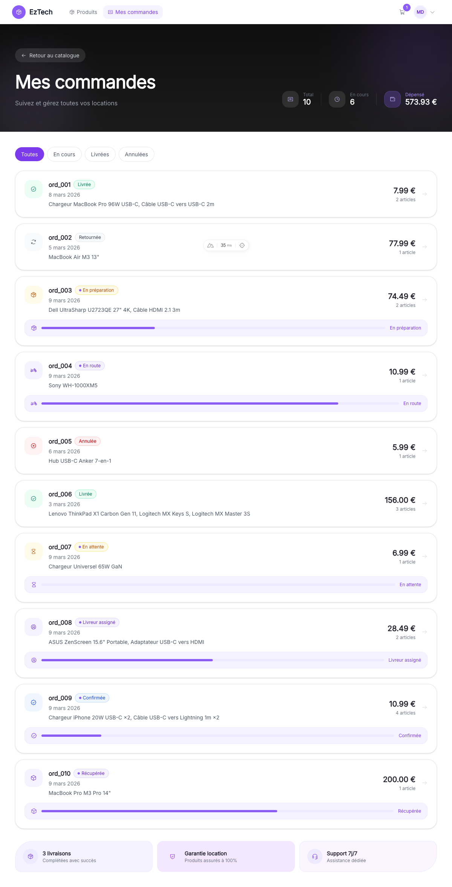

# EzTech Frontend

Plateforme de location de matériel tech livrée à Paris. Built with **Nuxt 4**, **Vue 3**, **TypeScript**, **Tailwind CSS v4**, **Pinia**, **Zod** and **shadcn-vue**.

## Sommaire

- [Présentation](#présentation)
- [Fonctionnalités](#fonctionnalités)
- [Screens](#screens)
- [Prérequis](#prérequis)
- [Installation](#installation)
- [Lancement en développement](#lancement-en-développement)
- [Scripts](#scripts)
- [Configuration mock](#configuration-mock)
- [Identifiants de test](#identifiants-de-test)
- [Flux de test bout en bout](#flux-de-test-bout-en-bout)
- [Zones de service](#zones-de-service-mock)
- [Architecture technique](#architecture-technique)
- [Structure du projet](#structure-du-projet)
- [Routes protégées](#routes-protégées)
- [Dépendances clés](#dépendances-clés)
- [Limites et améliorations possibles](#limites-et-améliorations-possibles)

## Présentation

EzTech est une application web de location d'équipement tech (ordinateurs, appareils photo, drones, tablettes) livrée à domicile dans Paris. L'utilisateur parcourt le catalogue, ajoute des produits au panier avec une **durée de location paramétrable** (heure / jour / semaine) pour les produits à tarification progressive, choisit une adresse de livraison validée par une **vérification de zone géographique**, puis règle sa commande par carte bancaire (paiement mocké).

Le frontend est livré en **mode mock** pour la Phase 1 : toutes les données (produits, utilisateurs, zones de service) sont lues depuis des fichiers JSON, et le "paiement" est une simulation locale. La Phase 2 branchera l'API Express + PostgreSQL + MongoDB via la variable `VITE_USE_MOCK=false`.

## Fonctionnalités

- **Authentification multi-rôles** (client / livreur) avec store Pinia + persistance `localStorage`
- **Catalogue produits** avec recherche, filtrage par catégorie, fiches détaillées et tarification à paliers (location à l'heure, à la journée, à la semaine)
- **Panier dynamique** : stepper quantité (via `defineModel`), sélecteur de durée (`v-model:value` + `v-model:unit`), recalcul instantané du total
- **Checkout avec 3 modes d'adresse** :
  1. Sélection parmi les adresses enregistrées du compte
  2. Saisie manuelle d'une adresse
  3. Géolocalisation navigateur (`navigator.geolocation`)
- **Validation de zone de service** avec Turf.js (point-in-polygon sur `service-zones.json`) : commandes refusées hors zone
- **Paiement mocké** avec cartes de test (succès / échec) et écran de succès animé
- **Suivi de commande** avec carte Leaflet temps réel (Phase 1 : animation mockée du livreur)
- **Profil utilisateur** : gestion des informations personnelles, mot de passe, adresses et informations véhicule (livreurs)
- **Espace livreur** : dashboard avec statistiques et liste des livraisons
- **Landing page** : hero, grille de fonctionnalités, section « comment ça marche », témoignages, CTA, footer
- **Formulaires validés** via schémas **Zod** partagés (login, register client, register livreur, forgot-password, profil)
- **Middleware Nuxt** : `auth` (protège les pages connectées) et `guest` (redirige les utilisateurs déjà connectés)
- **Composants réutilisables** : `QuantityStepper`, `DurationSelector`, `CartItemRow`, `PriceSummary`, `EmptyState`, `AddressCard`, `ZoneBadge`, `FormField`, `LeafletMap`, `ProductCard`

## Screens

| Page | Capture |
|---|---|
| Landing — hero, fonctionnalités, catalogue teaser |  |
| Login — validation Zod, comptes de test |  |
| Panier — stepper quantité + sélecteur de durée + recap |  |
| Checkout — sélection d'adresse, badge de zone, carte |  |
| Register — toggle Customer / Rider, validation Zod |  |
| Catalogue — recherche, filtre par catégorie |  |
| Fiche produit — galerie, durée, spécifications |  |
| Commandes — liste filtrée par statut |  |
| Profil — infos personnelles, adresses, mot de passe |  |

## Prérequis

- Node.js 20+
- npm 10+ (pnpm ou yarn supportés)

## Installation

```bash
cd frontend
npm install
cp .env.example .env
```

## Lancement en développement

```bash
npm run dev
```

L'application est disponible sur `http://localhost:3000` (ou `3001` si le port 3000 est occupé).

## Scripts

| Commande           | Description                           |
| ------------------ | ------------------------------------- |
| `npm run dev`      | Serveur de développement avec HMR     |
| `npm run build`    | Build de production                   |
| `npm run preview`  | Prévisualiser le build de production  |
| `npm run generate` | Génération statique                   |

## Configuration mock

Le frontend fonctionne en mode mock par défaut (données lues depuis `app/data/mock/*.json`).

```env
# .env
VITE_USE_MOCK=true                          # mode mock on (défaut)
VITE_API_URL=http://localhost:3001/api      # utilisé quand VITE_USE_MOCK=false
```

La bascule se fait via `app/composables/useMock.ts`, lu depuis `runtimeConfig.public.useMock` dans `nuxt.config.ts`.

## Identifiants de test

Tous les comptes mock utilisent le mot de passe `password123`.

| Rôle    | Email                  |
| ------- | ---------------------- |
| Client  | `marie@example.com`    |
| Client  | `sophie@example.com`   |
| Livreur | `lucas@example.com`    |
| Livreur | `camille@example.com`  |

## Flux de test bout en bout

1. Se connecter avec `marie@example.com` / `password123`
2. Aller sur `/cart` — utiliser le bouton « Remplir avec des articles de démo »
3. Cliquer « Passer au paiement »
4. Choisir une adresse enregistrée (zone Paris Centre ou Paris Est) ou « Ma position »
5. Carte test : `4242 4242 4242 4242` (succès) / `4242 4242 4242 0000` (échec)
6. Redirection automatique vers `/orders/<id>` avec suivi de livraison

## Zones de service (mock)

La vérification de zone utilise Turf.js et `app/data/mock/service-zones.json` :

- **Paris Centre** (actif) : env. 2,30–2,385 E, 48,835–48,880 N
- **Paris Est** (actif) : env. 2,385–2,460 E, 48,835–48,880 N
- **Paris Ouest** (inactif — tester le rejet de zone)

## Architecture technique

### Composants Vue réutilisables (10+)

| Composant | Props / v-model | Emits | Slots | Description |
|---|---|---|---|---|
| `QuantityStepper` | `defineModel<number>`, `min`, `max` | — | — | Stepper +/- avec contraintes |
| `DurationSelector` | `defineModel('value')`, `defineModel('unit')` | — | — | Double v-model durée + unité |
| `CartItemRow` | `item` | `remove`, `updateQuantity`, `updateDuration` | — | Ligne panier avec image et contrôles |
| `PriceSummary` | `subtotal`, `deliveryFee`, `total` | — | `#actions`, `#footer` | Récap prix sticky |
| `EmptyState` | `title`, `description` | — | `#icon`, `#actions` | État vide générique |
| `FormField` | `id`, `label`, `error`, `hint`, `required` | — | default | Wrapper label + erreur + input |
| `ProductCard` | `product`, `to`, `ctaLabel` | — | — | Carte produit catalogue |
| `AddressCard` | `address`, `selected` | — | — | Carte adresse sélectionnable |
| `ZoneBadge` | `inZone`, `zoneName` | — | — | Badge statut zone de service |
| `LeafletMap` | `center`, `zoom`, `route`, `warehousePos`, `destinationPos`, `animateRider`, `height` | — | — | Carte Leaflet client-only |

### Composables personnalisés (6)

| Composable | Rôle |
|---|---|
| `useMock` | Drapeau `isMock` depuis `runtimeConfig` |
| `useServiceZone` | Validation point-in-polygon via Turf.js |
| `useBodyScrollLock` | Verrouille le scroll body (menu mobile) |
| `useScrollState` | Détecte le scroll au-delà d'un seuil |
| `useLandingContent` | Contenu statique typé pour la landing |
| `useMotionPresets` | Presets d'animation `@vueuse/motion` |

### Stores Pinia (3)

| Store | État principal | Getters | Actions clés |
|---|---|---|---|
| `auth` | `user`, `token`, `hydrated` | `isAuthenticated`, `role` | `login`, `register`, `logout`, `hydrate` |
| `cart` | `items`, `hydrated` | `count`, `subtotal`, `total`, `isEmpty` | `addItem`, `removeItem`, `updateQuantity`, `updateDuration`, `clearCart` |
| `orders` | `orders`, `hydrated` | `activeOrders`, `deliveredOrders`, `cancelledOrders`, `orderById` | `createOrder`, `simulateDelivery` |

### Middleware Nuxt (2)

| Middleware | Rôle |
|---|---|
| `auth` | Redirige vers `/login?redirect=…` si non authentifié |
| `guest` | Redirige vers `/products` si déjà authentifié |

### Validation Zod — schémas partagés (`lib/schemas.ts`)

`loginSchema`, `forgotPasswordSchema`, `registerCustomerSchema`, `registerRiderSchema`, `profilePersonalSchema`, `profilePasswordSchema`, `profileAddressSchema`, `profileVehicleSchema`

Chaque formulaire utilise `zodErrorsToRecord()` pour afficher les erreurs champ par champ.

### Fonctionnalités avancées

- **Watchers élaborés** : watch sur `product.stock` pour ajuster la quantité, watch sur `isAuthenticated` pour redirection, watch sur route path pour fermer le menu
- **Computed élaborés** : filtrage catalogue par catégorie, calcul prix dynamique par durée, résolution d'adresse selon le mode (enregistrée / manuelle / géoloc), détection marque carte bancaire
- **Composables personnalisés** : 6 composables couvrant mock, géo, scroll, animations
- **Slots nommés** : `PriceSummary` (`#actions`, `#footer`), `EmptyState` (`#icon`, `#actions`), `FormField` (default)
- **Middleware Nuxt** : `auth` et `guest` appliqués via `definePageMeta()`
- **Client-only rendering** : `LeafletMap.client.vue` (code splitting SSR)
- **defineModel** : `QuantityStepper`, `DurationSelector`, `AppNavbar` (v-model:open)

## Structure du projet

```
frontend/
├── app/
│   ├── assets/                    # CSS Tailwind et images
│   ├── components/
│   │   ├── ui/                    # primitives shadcn-vue (Button, Card, Input, Tabs, …)
│   │   ├── landing/               # composants landing page (Navbar, Hero, Features, …)
│   │   ├── AddressCard.vue        # carte d'adresse sélectionnable
│   │   ├── CartItemRow.vue        # ligne de panier réutilisable
│   │   ├── DurationSelector.vue   # v-model:value + v-model:unit
│   │   ├── EmptyState.vue         # état vide avec slots nommés
│   │   ├── FormField.vue          # wrapper label + input + erreur
│   │   ├── LeafletMap.client.vue  # carte suivi livraison (client-only)
│   │   ├── PriceSummary.vue       # récap prix avec slots
│   │   ├── ProductCard.vue        # carte produit catalogue
│   │   ├── QuantityStepper.vue    # defineModel<number>
│   │   ├── TheAppBar.vue          # barre de navigation principale
│   │   └── ZoneBadge.vue          # badge de zone de service
│   ├── composables/
│   │   ├── useBodyScrollLock.ts   # verrouillage scroll body
│   │   ├── useLandingContent.ts   # contenu statique landing
│   │   ├── useMock.ts             # drapeau VITE_USE_MOCK
│   │   ├── useMotionPresets.ts    # presets animation vueuse/motion
│   │   ├── useScrollState.ts      # détection seuil scroll
│   │   └── useServiceZone.ts      # point-in-polygon Turf.js
│   ├── stores/
│   │   ├── auth.ts                # Pinia store auth + adresses
│   │   ├── cart.ts                # Pinia store panier + pricing
│   │   └── orders.ts              # Pinia store commandes + suivi
│   ├── lib/
│   │   └── schemas.ts             # schémas Zod (login, register, profil, …)
│   ├── data/mock/                 # JSON mock (produits, utilisateurs, zones, …)
│   ├── layouts/                   # auth.vue, default
│   ├── middleware/
│   │   ├── auth.ts                # garde routes protégées
│   │   └── guest.ts               # redirige si déjà connecté
│   └── pages/
│       ├── index.vue              # landing page
│       ├── login.vue              # connexion
│       ├── register.vue           # inscription client / livreur
│       ├── forgot-password.vue    # mot de passe oublié
│       ├── products/              # catalogue + fiche produit [id]
│       ├── cart.vue               # panier
│       ├── checkout.vue           # paiement + adresse + zone
│       ├── orders/                # liste commandes + détail [id]
│       ├── profile.vue            # gestion profil
│       └── rider/                 # dashboard + livraisons livreur
├── docs/screens/                  # captures d'écran
├── nuxt.config.ts
└── package.json
```

## Routes protégées

Les pages suivantes utilisent le middleware `auth` et redirigent vers `/login?redirect=…` si non authentifié :

- `/cart`
- `/checkout`
- `/orders`, `/orders/:id`
- `/profile`
- `/rider/dashboard`, `/rider/deliveries`

Les pages suivantes utilisent le middleware `guest` et redirigent vers `/products` si déjà connecté :

- `/` (landing)
- `/login`
- `/register`
- `/forgot-password`

## Dépendances clés

| Catégorie | Packages |
|---|---|
| Framework | Nuxt 4, Vue 3, TypeScript |
| État global | Pinia (`@pinia/nuxt`) |
| Validation | Zod |
| Styles | Tailwind CSS v4 (`@tailwindcss/vite`), `class-variance-authority`, `clsx`, `tailwind-merge` |
| Composants UI | shadcn-vue, reka-ui, radix-vue |
| Cartes | Leaflet, `@turf/boolean-point-in-polygon`, `@turf/helpers` |
| Animations | `@vueuse/motion` |
| Icônes | `@nuxt/icon`, lucide-vue-next |

## Limites et améliorations possibles

### Limites actuelles (Phase 1 — mock)

- **Aucun backend** : toutes les requêtes sont mockées, pas de persistance serveur. Les commandes et le panier sont stockés dans `localStorage`.
- **Paiement simulé** : pas d'intégration Stripe réelle. La validation de carte est basée sur les derniers chiffres (`…0000` → échec).
- **Suivi de commande animé** : la position du livreur est interpolée côté client, pas de WebSocket ni de géolocalisation réelle du livreur.
- **OAuth non fonctionnel** : les boutons « Continue with Google » sont des placeholders.
- **Pas de tests unitaires** : aucun harness Vitest en place.
- **Géocodage inverse manquant** : en mode « saisie manuelle », aucune coordonnée n'est résolue, donc la validation de zone est ignorée si l'utilisateur ne passe pas par « Ma position » ou une adresse enregistrée.
- **Pas de reset password réel** : la page `/forgot-password` est cosmétique en mode mock.
- **Pas de dashboard / graphiques** : le dashboard livreur est un listing simple.

### Améliorations prévues (Phase 2)

- **Backend Express + PostgreSQL + MongoDB** branché via `VITE_USE_MOCK=false`
- **Intégration Stripe** réelle avec 3DS
- **WebSocket** pour suivi livreur temps réel
- **Geocoding** via Mapbox / HERE pour résoudre les adresses saisies manuellement
- **Tests unitaires Vitest** sur stores, schémas Zod et composants clés
- **Dashboard admin** avec graphiques (Chart.js) : CA, commandes par zone, taux de conversion
- **Notifications push** via `@vueuse/useWebNotification`
- **i18n** (`@nuxtjs/i18n`) pour basculer FR / EN
- **PWA** pour installation mobile
- **Tests E2E** Playwright sur le flux panier → paiement → commande
